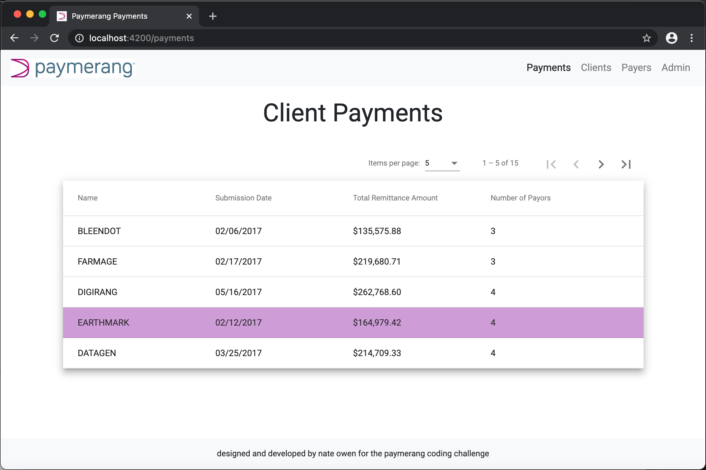
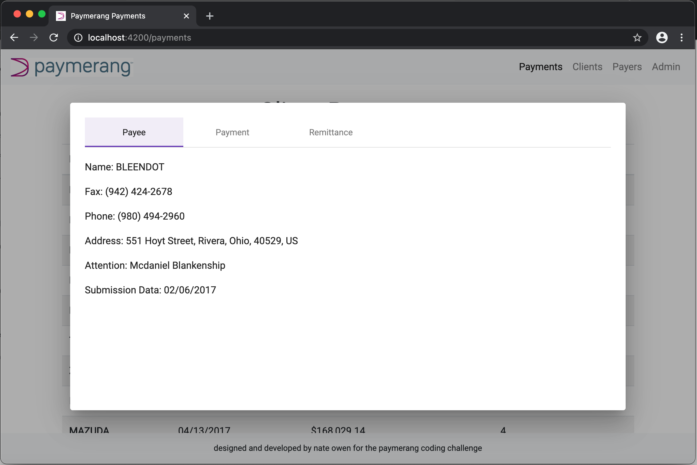

# PaymerangCodingChallenge

To see this app in action, go to the following address: https://mystifying-villani-9310fb.netlify.app

When first starting the app, you will be brought to the Client Payments page (pictured below).

You can then click on any of the payments to view detailed information such as Payee, Payment and Remittance information (pictured below). You can also sort ascending and descending by clicking any column header.

